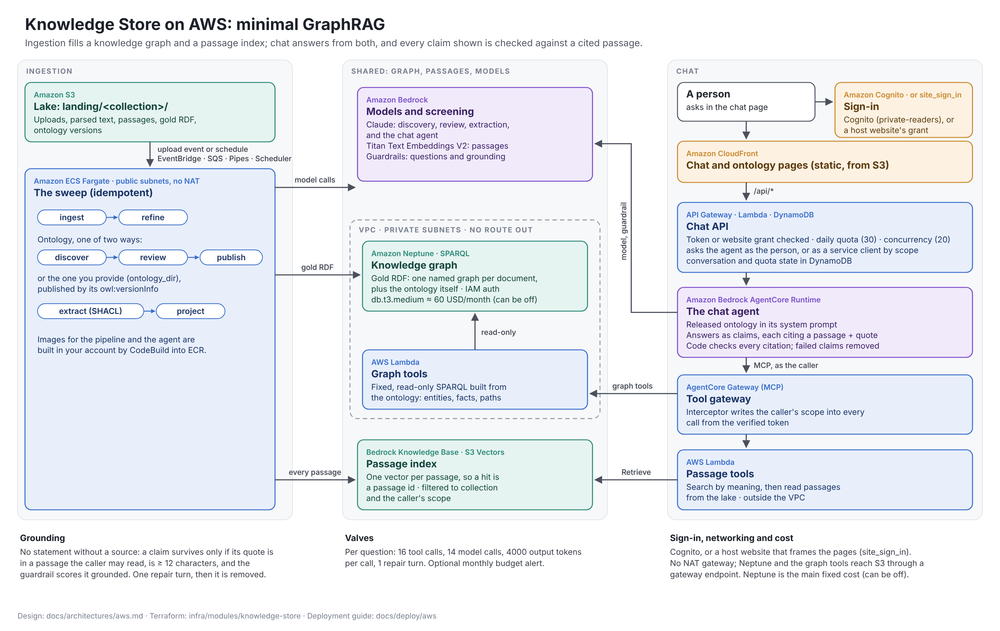

# Deploying Knowledge Store on AWS

This guide takes you from an empty AWS account (or a landing-zone account with its own network
and controls) to a running Knowledge Store: documents go in, an ontology is applied to them, a
knowledge graph comes out, and people ask questions in a chat page that answers from the graph,
every statement linked to the passage it comes from.

You deploy it with the Terraform in this repository and your own parameters. Nothing is built on
your machine: container images are built by CodeBuild inside your account.

| In this pack | What it is |
|---|---|
| [README.md](README.md) (this file) | Step-by-step configuration and installation, then operation and removal |
| [parameters.md](parameters.md) | Every parameter: what you must bring, what you may decide, the defaults |
| [components.md](components.md) | The components, and how each one is expressed in the Terraform |
| [architecture.png](architecture.png) / [architecture.svg](architecture.svg) | The reference architecture diagram |
| [architecture.drawio](architecture.drawio) | The same diagram as an editable draw.io file: open it in [diagrams.net](https://app.diagrams.net), the draw.io desktop app or its VS Code extension. `architecture.py` and `architecture_drawio.py` generate the SVG and the draw.io file |
| [`infra/stack`](../../../infra/stack) | The Terraform root you apply, with [`terraform.tfvars.example`](../../../infra/stack/terraform.tfvars.example) |
| [`infra/modules/knowledge-store`](../../../infra/modules/knowledge-store) | The module it calls, which holds everything |



Allow about an hour for a first installation, most of it waiting: Neptune and CloudFront take a
while to create, and the image builds take a few minutes each.

## At a glance: your part and Terraform's part

### What you do in your own infrastructure

Terraform cannot do these, because they are decisions or settings that belong to your account
and organisation:

| Step | You do | Required? |
|---|---|---|
| [3](#3-prepare-the-account) | Credentials for the target account, with rights to create IAM roles, networking, CloudFront, Cognito, Lambda, ECS, Neptune, Bedrock and AgentCore resources | Yes |
| [3.1](#31-bedrock-models) | Enable a Claude model and Titan Text Embeddings V2 in Bedrock, and find the Claude inference profile id for your region | Yes |
| [4](#4-get-the-code-and-a-state-bucket) | A state bucket: an existing one, or one created by `infra/bootstrap` | Yes |
| [3.3](#33-optional-a-certificate-for-the-portals-domain) | An ACM certificate in `us-east-1` for your own portal domain | Only for your own domain |
| [3.4](#34-optional-an-existing-vpc) | A VPC and subnets with the routes the stack needs | Only to use your own network |
| | An IAM permissions boundary policy that allows what [components.md](components.md#iam-roles) lists | Only if your organisation requires one |
| [3.1](#31-bedrock-models) | An Anthropic API key in Secrets Manager | Only to call the Anthropic API instead of Bedrock |
| [9](#9-optional-point-your-domain-at-the-portal) | A DNS record pointing your domain at CloudFront | Only for your own domain |
| [10](#10-sign-in-and-add-people) | Add people to Cognito, and private readers to `private-readers` | Yes, after the first apply |
| [11](#11-load-documents), [12](#12-give-each-collection-its-ontology) | Upload documents, and publish each collection's first ontology | Yes, after the first apply |

### What you give Terraform

Everything goes in `infra/stack/terraform.tfvars` (start from
[`terraform.tfvars.example`](../../../infra/stack/terraform.tfvars.example)), except the state
location, which goes in `infra/stack/backend.hcl`. Both files are gitignored.
[parameters.md](parameters.md) explains every input.

| | Parameters |
|---|---|
| Required | `admin_email` |
| Required outside US regions | `extraction_model_id`, `chat_model_id`, `agent.model_id`: the default `us.` inference profile works only in US regions |
| Usually set | `region`, `name`, `account_id` (a guard against the wrong account), `collections` |
| Your organisation's controls | `network` (`existing` for your own VPC), `permissions_boundary`, `extra_tags`, `log_retention_days`, `budget`, `portal_domain` |
| Sign-in through a website of your own | `site_sign_in` |
| Cost and capacity | `knowledge_graph`, `knowledge_base`, `daily_questions`, `valves`, `schedule_expression` |
| Second apply | `agent = { runtime = true }`, once the agent's image is built |

There is no secret value in either file. Credentials come from your environment (`AWS_PROFILE`,
SSO or a CI role), and Bedrock is reached through IAM. The one secret the stack can use, an
Anthropic API key, stays in Secrets Manager: Terraform gets only its ARN
(`anthropic_api_key_secret_arn`).

---

## 1. Before you start

### 1.1 What you need

- [ ] **An AWS account** you can deploy into, and credentials with administrator-level rights in
      it. Terraform creates IAM roles, a VPC (unless you bring one), CloudFront, Cognito, Lambda,
      ECS, Neptune, Bedrock and AgentCore resources.
- [ ] **A region** that offers every service the stack uses: Amazon Bedrock (with Anthropic
      Claude models and Amazon Titan Text Embeddings V2), Amazon Bedrock AgentCore (Runtime and
      Gateway), Amazon S3 Vectors, Bedrock Knowledge Bases and Amazon Neptune. Check the
      [AWS Regional Services list](https://aws.amazon.com/about-aws/global-infrastructure/regional-product-services/)
      for your region. `us-east-1` has all of them.
- [ ] **An email address** for the first user. Cognito sends it a temporary password.
- [ ] **On your machine** (or in the CI runner that applies):
  - Terraform 1.10 or later (the repository's CI uses 1.14.3)
  - AWS CLI v2
  - git
  - Python 3.12 or later, to curate ontologies and run evaluations

Optional, depending on your organisation:

- [ ] **A domain for the portal**, such as `knowledge.example.org`, and an ACM certificate for it
      in `us-east-1` (see [3.3](#33-optional-a-certificate-for-the-portals-domain)).
- [ ] **An existing VPC and subnets**, if your organisation does not allow workloads to create
      their own (see [3.4](#34-optional-an-existing-vpc)).
- [ ] **An IAM permissions boundary** that every role must carry.
- [ ] **A Terraform state bucket** you already use. Otherwise step 4 creates one.

### 1.2 What it costs

| Item | Cost |
|---|---|
| Neptune `db.t3.medium` | About 60 USD a month while it runs. It is the main fixed cost. `knowledge_graph = { enabled = false }` removes it. |
| NAT gateway, only if you set `network.enable_nat` | About 33 USD a month, plus data processed |
| Everything else at rest | Close to nothing: S3, S3 Vectors, CloudFront, Lambda, DynamoDB on demand, Fargate only while a sweep runs |
| Model calls | The cost that matters. Discovery and extraction read every document. Each question is several model calls, roughly 0.10 to 0.30 USD with a Sonnet-class model. |

Set `budget = { monthly_usd = ... }` to be emailed at 80% of actual and 100% of forecast spend.

---

## 2. Gather your parameters

Fill in the worksheet in [parameters.md](parameters.md#worksheet). Only `admin_email` is required.
For a first deployment in a sandbox account, every default works.

The questions that most often need an answer from someone else in your organisation are:

| Question | Parameter |
|---|---|
| Which region? | `region` |
| What prefix for resource names? It must be unique in the account. | `name` |
| Which Claude model, as an inference profile id valid in your region? | `extraction_model_id`, `chat_model_id`, `agent.model_id` |
| Our own VPC, or an existing one? Which CIDR is free? Is a NAT gateway allowed? | `network` |
| A domain of our own for the portal? | `portal_domain` |
| Must IAM roles carry a permissions boundary? | `permissions_boundary` |
| Which tags must every resource carry? | `extra_tags` |
| How long must logs be kept? | `log_retention_days` |
| Neptune, or a cheaper demo without it? | `knowledge_graph` |

---

## 3. Prepare the account

Run the commands in this guide with credentials for the target account and region:

```bash
export AWS_PROFILE=<your profile>   # or however your credentials are provided
export AWS_REGION=<your region>     # for example us-east-1
aws sts get-caller-identity         # check the account id is the one you expect
```

### 3.1 Bedrock models

The pipeline, the chat agent and the Knowledge Base call these models through Bedrock:

- **A Claude model** for discovery, extraction and chat. The default inference profile is
  `us.anthropic.claude-sonnet-5`.
- **Amazon Titan Text Embeddings V2** (`amazon.titan-embed-text-v2:0`) for the passage index.

1. In the Bedrock console for your region, open **Model catalog** and check that both models are
   available to your account. The first use of an Anthropic model in an account asks for a short
   use-case form; complete it if prompted.
2. Find the Claude **inference profile id** for your region. Profiles carry a geography prefix,
   such as `us.`, `eu.`, `apac.` or `global.`:

   ```bash
   aws bedrock list-inference-profiles \
     --query "inferenceProfileSummaries[?contains(inferenceProfileId, 'anthropic')].inferenceProfileId"
   ```

   Outside the US, the default `us.` id does not work. Set the id you find in `extraction_model_id`,
   `chat_model_id` and `agent.model_id` in step 5.
3. Check that you can call both models:

   ```bash
   aws bedrock-runtime converse --model-id <inference profile id> \
     --messages '[{"role":"user","content":[{"text":"Say hello"}]}]'

   aws bedrock-runtime invoke-model --model-id amazon.titan-embed-text-v2:0 \
     --body '{"inputText":"hello"}' --cli-binary-format raw-in-base64-out /dev/stdout | head -c 200
   ```

   Both should succeed. An `AccessDeniedException` means the model is not enabled for the account
   or region yet. A `ValidationException` about the model id means the id is not valid in this region.

To send model calls to the Anthropic API instead of Bedrock (pipeline and portal only; the chat
agent always uses Bedrock), store the API key in Secrets Manager and set
`llm_provider = "anthropic"` and `anthropic_api_key_secret_arn` in step 5.

### 3.2 Service quotas

A new account's default quotas are enough for a first deployment. For large corpora or many
users, review the Bedrock tokens-per-minute quota for your model (Service Quotas, Amazon Bedrock)
before you load documents.

### 3.3 Optional: a certificate for the portal's domain

CloudFront only accepts certificates from ACM in `us-east-1`, whatever region the stack is in:

```bash
aws acm request-certificate --region us-east-1 \
  --domain-name knowledge.example.org --validation-method DNS
aws acm describe-certificate --region us-east-1 --certificate-arn <arn> \
  --query "Certificate.DomainValidationOptions[0].ResourceRecord"
```

Create the validation record it shows in your DNS, and wait until the certificate's status is
`ISSUED`. You will point the name itself at CloudFront in step 9.

### 3.4 Optional: an existing VPC

By default the stack creates its own VPC (`10.42.0.0/16`, two availability zones) with no NAT
gateway. To use a VPC you already have, you need:

| Subnets | Count | Must reach | Used by |
|---|---|---|---|
| `private_subnet_ids` | 2 or more, in different availability zones | S3, through a gateway endpoint on their route table or a NAT | Neptune and the graph tools' Lambda |
| `pipeline_subnet_ids` | 1 or more | Bedrock (or the Anthropic API), ECR and S3: through an internet gateway (set `pipeline_public_ip = true`), a NAT gateway, or VPC interface endpoints for `bedrock-runtime`, `bedrock-agent`, `ecr.api`, `ecr.dkr`, `logs` and `sts`, plus the S3 gateway endpoint | The pipeline's Fargate tasks |

The stack creates its own security groups in the VPC. Neptune accepts connections on port 8182
only from the pipeline's tasks and the graph tools.

---

## 4. Get the code and a state bucket

1. Clone the repository:

   ```bash
   git clone https://github.com/patternode/knowledge-store.git
   cd knowledge-store
   ```

   Stay on `main` for now: the newest tag, v0.1.2, predates the knowledge graph, the passage index
   and the chat agent this guide describes. Once v0.2.0 is tagged, check it out
   (`git checkout v0.2.0`) so the deployment does not move when `main` does.

2. Terraform keeps its state in S3.
   - If your organisation already has a state bucket, write `infra/stack/backend.hcl`:

     ```hcl
     bucket = "<your state bucket>"
     region = "<the bucket's region>"
     ```

   - Otherwise create one, once per account:

     ```bash
     cd infra/bootstrap
     terraform init
     terraform apply -var account_id=<your account id> -var region=$AWS_REGION
     terraform output -raw backend_hcl > ../stack/backend.hcl
     cd ../..
     ```

   The state key is `knowledge-store/terraform.tfstate`. To keep two deployments in one bucket,
   add `key = "<another key>"` to `backend.hcl`.

---

## 5. Configure

```bash
cd infra/stack
cp terraform.tfvars.example terraform.tfvars
```

Edit `terraform.tfvars`. Every parameter is listed there with its default, and explained in
[parameters.md](parameters.md). `terraform.tfvars` and `backend.hcl` are gitignored.

**A first deployment** needs one line:

```hcl
admin_email = "you@example.org"
```

**A deployment into an organisation's account** typically looks like this:

```hcl
admin_email = "knowledge-admin@example.org"
region      = "eu-west-1"
name        = "kstore-prod"
account_id  = "123456789012"   # refuse to apply anywhere else
extra_tags  = { cost-centre = "4711", owner = "data-platform", environment = "prod" }

# Models: the inference profile ids found in step 3.1
extraction_model_id = "eu.anthropic.claude-sonnet-5"
chat_model_id       = "eu.anthropic.claude-sonnet-5"
agent               = { model_id = "eu.anthropic.claude-sonnet-5" }

# The organisation's network
network = {
  existing = {
    vpc_id              = "vpc-0123456789abcdef0"
    private_subnet_ids  = ["subnet-0aaa", "subnet-0bbb"]
    pipeline_subnet_ids = ["subnet-0ccc", "subnet-0ddd"]
    pipeline_public_ip  = false
  }
}

# The organisation's controls
permissions_boundary = "arn:aws:iam::123456789012:policy/workload-boundary"
log_retention_days   = 365
budget               = { monthly_usd = 500, email = "finops@example.org" }

# The portal on our own domain
portal_title  = "Policy Assistant"
portal_domain = { name = "knowledge.example.org", certificate_arn = "arn:aws:acm:us-east-1:123456789012:certificate/..." }

# One collection per corpus
collections = {
  policies = {
    profile = {
      name              = "Card policies"
      description       = "The card operations manuals and policies."
      key_terms         = ["card", "chargeback", "dispute"]
      example_questions = ["What happens when an ATM keeps a card abroad?"]
      ontology_base     = "https://data.example.org/policies/ontology#"
    }
  }
}
```

Two rules to keep in mind:

- `name` prefixes every resource. IAM role names must be unique in an account, so two
  deployments in one account need two names. It cannot be changed after the first apply
  without recreating the stack.
- Changing the embedding model after the first apply replaces the passage index, and the next
  sweep embeds every passage again.

---

## 6. Initialise and plan

```bash
terraform init -backend-config=backend.hcl
terraform plan -out tfplan
```

Read the plan before you apply. On a first deployment it only creates resources. Check that:

- the account id and region in the resource ARNs are the ones you expect
- resource names start with your `name`
- with `network.existing` set, no `aws_vpc` or `aws_subnet` is created
- with `permissions_boundary` set, every `aws_iam_role` shows it

If `plan` fails on a variable, its error message says what is wrong (for example, a certificate
outside `us-east-1`, or a single private subnet).

---

## 7. First apply

```bash
terraform apply tfplan
```

This takes about 15 to 30 minutes, most of it Neptune and CloudFront. When it finishes:

```bash
terraform output
```

| Output | What it is |
|---|---|
| `portal_url` | The chat page |
| `portal_cloudfront_domain` | Where the portal's DNS name must point, if you set `portal_domain` |
| `upload_to` | Where each collection's documents go |
| `image_build_project` | The CodeBuild project that builds the pipeline's image |
| `agent` | The chat agent: its Runtime (empty until step 8), Gateway, guardrail, and its image build project |
| `pipeline_logs` | The pipeline's CloudWatch log group |
| `cognito_user_pool` | The user pool, for adding users |
| `run_now` | A command that starts a sweep by hand |
| `knowledge_graph`, `knowledge_base` | Neptune and the Knowledge Base (null when switched off) |
| `evaluate` | A command that runs an evaluation set against the deployed chat |

The first apply also starts two image builds in CodeBuild: the pipeline's image, and the chat
agent's image. Wait for both to succeed:

```bash
for p in $(terraform output -raw image_build_project) $(terraform output -json agent | python3 -c 'import json,sys; print(json.load(sys.stdin)["image_project"])'); do
  id=$(aws codebuild list-builds-for-project --project-name "$p" --query 'ids[0]' --output text)
  echo "$p: $(aws codebuild batch-get-builds --ids "$id" --query 'builds[0].buildStatus' --output text)"
done
```

Repeat until both say `SUCCEEDED` (a few minutes). If either says `FAILED`, see
[Troubleshooting](#troubleshooting).

---

## 8. Second apply: switch on the chat agent

The agent's AgentCore Runtime needs its image, which exists only after the first build. Add this
to `terraform.tfvars`, keeping any `model_id` you set:

```hcl
agent = { runtime = true }
```

Then apply again:

```bash
terraform plan -out tfplan
terraform apply tfplan
terraform output agent    # runtime_arn is now set
```

Until this step, the chat page answers with the portal's own tool loop over the lake, without the
agent, the Gateway's scoped tools or the guardrail.

---

## 9. Optional: point your domain at the portal

If you set `portal_domain`, create a DNS record for the name that points at `portal_cloudfront_domain`:

- **Route 53:** an alias A (and AAAA) record targeting the CloudFront distribution
- **Any other DNS:** a CNAME to the `portal_cloudfront_domain` value

The portal also stays reachable on its CloudFront domain, and sign-in accepts both URLs.

---

## 10. Sign in and add people

1. The admin user receives an email from Cognito with a temporary password. It is valid for
   seven days.
2. Open `portal_url`, sign in with the email and the temporary password, and choose a new
   password (at least 12 characters, with upper and lower case letters and a number).
3. Add more people. There is no self sign-up:

   ```bash
   POOL=$(terraform output -raw cognito_user_pool)
   aws cognito-idp admin-create-user --user-pool-id "$POOL" --username person@example.org \
     --user-attributes Name=email,Value=person@example.org Name=email_verified,Value=true
   ```

4. People who may read **private** sources join the `private-readers` group. Everyone else sees
   public sources only, whatever they ask:

   ```bash
   aws cognito-idp admin-add-user-to-group --user-pool-id "$POOL" \
     --username person@example.org --group-name private-readers
   ```

With `admin_private = true` (the default), the admin user is already in the group.

---

## 11. Load documents

Upload each collection's documents to its `upload_to` location. Folders are kept as metadata:

```bash
terraform output upload_to
aws s3 cp ./my-documents/ s3://<name>-lake-<account>/landing/<collection>/ --recursive
```

Each upload starts the pipeline within about a minute, and a schedule (every 6 hours by default)
catches anything missed. Watch it:

```bash
aws logs tail $(terraform output -raw pipeline_logs) --follow
```

Upload large sets in a few batches rather than many single files: each upload event starts a
short-lived task. Only one task sweeps at a time; the others exit at once.

To try the stack before your own content is ready, upload the sample in
[`examples/space-missions`](../../../examples/space-missions).

---

## 12. Give each collection its ontology

Extraction runs against an ontology, so a collection produces a knowledge graph only once it has
one. Choose one way per collection:

| Way | Set | What happens |
|---|---|---|
| **Curated** (default) | `ontology_mode = "curated"` | Once at least `discovery.min_docs` documents (5) are in, the sweep discovers a draft ontology, reviews it, and waits for a person to publish it |
| **Automatic** | `ontology_mode = "auto"` | The first discovered draft is published unreviewed. This suits a trial. |
| **Your own** | `ontology_dir = "<dir>"` | Terraform uploads your `ontology.ttl` (and optional `shapes.ttl`). The sweep publishes it as the version its `owl:versionInfo` names, and discovery never runs. To change it, edit it, bump `owl:versionInfo`, and apply. |

To curate a draft:

```bash
cd <repository root>
python3 -m venv .venv && . .venv/bin/activate
pip install ".[aws]"
export LAKE_URI=s3://$(terraform -chdir=infra/stack output -raw lake_bucket)

aws s3 ls $LAKE_URI/collections/<collection>/ontology/drafts/   # the draft ids
knowledge-store -c <collection> ontology pull <draft id> ontology/<collection>/
# edit ontology/<collection>/ontology.ttl, and set owl:versionInfo to "1.0.0"
knowledge-store -c <collection> ontology publish ontology/<collection>/ --activate
```

Publishing starts extraction. When it finishes, the sweep loads the graph into Neptune and the
passages into the Knowledge Base. Keep the curated files under version control: they are the
master of the collection's ontology.

---

## 13. Check that it works

- [ ] The portal opens at `portal_url` (and at your domain, if set), and sign-in works.
- [ ] `aws logs tail $(terraform output -raw pipeline_logs)` shows a sweep that ingested,
      refined, extracted and projected your documents without errors.
- [ ] `terraform output agent` shows a `runtime_arn`.
- [ ] A question about your documents gets an answer with numbered links to passages, and each
      link opens the source.
- [ ] A question the documents cannot answer gets "the sources cannot answer this", not a guess.
- [ ] A user outside `private-readers` does not see private sources.
- [ ] The workbench beside the chat shows the agent's steps while it answers, and "What would it
      take to answer this?" returns a report ([docs/workbench.md](../../workbench.md)).

To measure answer quality, write an evaluation set (format in
[docs/architectures/aws.md](../../architectures/aws.md#evaluation)) and run the `evaluate` output's
command as a signed-in user. Every question is a model run and costs money; without `--yes` the
command prints its estimate and stops.

---

## Operating it

**Change a setting.** Edit `terraform.tfvars`, then `terraform plan -out tfplan` and
`terraform apply tfplan`. Collections, profiles, valves, quotas, models and the schedule can all
change in place.

**Upgrade.** Check out the new release, read its `CHANGELOG.md` entry, then plan and apply. A
change to the code rebuilds the images (CodeBuild starts on its own). The portal and tool Lambdas
are updated by the apply.

**Pin the agent.** Once a Runtime version is tested, set `agent = { runtime = true, prod_version = "<version>" }`.
The portal then calls the `prod` endpoint, and new versions do not reach users until you move the pin.

**Control cost and load.** These limits are variables:

- `daily_questions`: questions per person per day
- `valves.chat_concurrency`: questions answered at once. `0` switches the chat off.
- `valves.max_tool_calls`, `valves.max_model_calls`, `valves.max_output_tokens`: per question
- `schedule_enabled`: the periodic sweep
- `budget`: a monthly cost alert

**Refine the ontology from questions.** The chat's workbench shows which ontology terms
questions use (the question overlay on the ontology page), and for a question that goes
unanswered, what it would take: ontology extensions, data to add, or facts extraction missed. A
member of `private-readers` can keep that report as an ontology request.
`knowledge-store -c <collection> candidates --propose` then drafts the next ontology version from
the requests and from the terms extraction found missing, for a curator to publish. See
[docs/workbench.md](../../workbench.md).

**Logs.**

| What | Where |
|---|---|
| Pipeline | `/ecs/<name>-pipeline` |
| Chat API | `/aws/lambda/<name>-portal-api` |
| Graph tools | `/aws/lambda/<name>-tools-graph` |
| Passage tools | `/aws/lambda/<name>-tools-passages` |
| Agent | under `/aws/bedrock-agentcore/` |
| Image builds | `/codebuild/<name>-image`, `/codebuild/<name>-agent-image` |
| Neptune audit log | CloudWatch, exported by the cluster |

**Back-ups.** The lake is the record: versioned, with old versions kept for 30 days. Neptune and
the Knowledge Base are projections of the lake, rebuilt by the sweep, so they need no back-up of
their own.

## Removing it

```bash
cd infra/stack
terraform destroy
```

- The lake bucket is kept if it still holds objects, unless `force_destroy_lake = true` was
  applied first. Empty it, or set that and apply, before destroying, if the data should go.
- With `knowledge_graph.deletion_protection = true`, set it to `false` and apply before destroying.
- The state bucket created by `infra/bootstrap` is protected from deletion; remove it by hand if
  you no longer need it.

---

## Troubleshooting

| Symptom | Likely cause and fix |
|---|---|
| `plan` fails on `network`, `portal_domain` or `log_retention_days` | The validation message says what to fix: two private subnets in different zones, a certificate in `us-east-1`, or a retention value CloudWatch accepts. |
| `apply` fails with `AccessDenied` on IAM | The applying identity lacks rights, or the permissions boundary forbids something the roles need. The boundary must allow the actions in [components.md](components.md#iam-roles). |
| `apply` fails creating a Cognito domain or a bucket that already exists | `name` is already used by another deployment in the account. Choose another `name`. |
| An image build `FAILED` | Read its log in `/codebuild/<name>-image` or `/codebuild/<name>-agent-image`. To retry, run `aws codebuild start-build` with the source of its last build. Any later change to the code also rebuilds. |
| Uploads do not start the pipeline | Check the uploads queue's dead-letter queue (`<name>-uploads-dlq`) and the Pipe `<name>-uploads`. The scheduled sweep still runs every `schedule_expression`. |
| Pipeline log shows `AccessDeniedException` from Bedrock | The model id is not enabled, or not valid in this region. See [3.1](#31-bedrock-models). |
| Pipeline tasks never start, or cannot pull the image | With `network.existing`: the pipeline subnets cannot reach ECR, or a public subnet is used without `pipeline_public_ip = true`. |
| Graph tools time out | With `network.existing`: the private subnets cannot reach S3 (add the S3 gateway endpoint to their route table), or a network ACL blocks port 8182 inside the VPC. |
| No ontology after uploading | Curated mode waits for at least `discovery.min_docs` documents and then for a person to publish (step 12). |
| `apply` stops at the Neptune instance with `InvalidVPCNetworkStateFault ... no subnets exist in Availability Zones with sufficient capacity`, naming another zone | The default VPC spans the account's first two zones, and neither has capacity for the instance class. Raise `network.az_count` until the named zone is included (for us-east-1d, `az_count = 4`), plan and apply again: subnets are added by position, so the existing ones stay. With `network.existing`, add a private subnet in the named zone. Or choose another `knowledge_graph.instance_class` (in us-east-1, `db.t4g.medium` moved between zones while `db.t3.medium` was available), or Neptune Serverless (`serverless_min_ncu = 1`). |
| The chat answers but without the agent | `agent.runtime` is not `true` yet (step 8). |
| Sign-in redirects to an error | The URL is neither `portal_url` nor the CloudFront domain, or DNS for `portal_domain` points elsewhere. |
